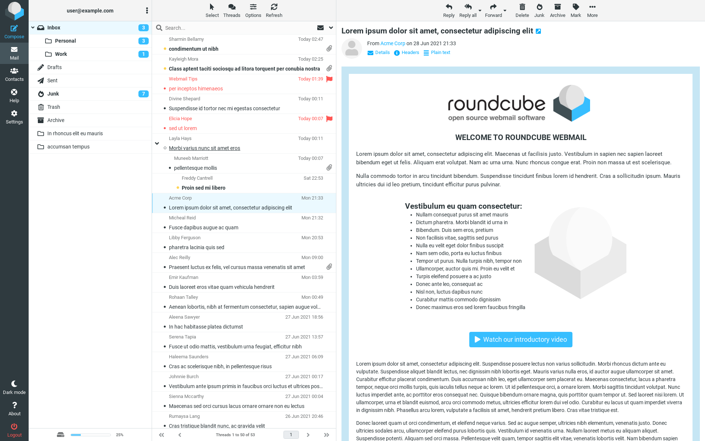

<!--
N.B.: This README was automatically generated by https://github.com/YunoHost/apps/tree/master/tools/README-generator
It shall NOT be edited by hand.
-->

# Roundcube pour YunoHost

[](https://dash.yunohost.org/appci/app/roundcube)  

[](https://install-app.yunohost.org/?app=roundcube)

*[Read this readme in english.](./README.md)*

> *Ce package vous permet d’installer Roundcube rapidement et simplement sur un serveur YunoHost.
Si vous n’avez pas YunoHost, regardez [ici](https://yunohost.org/#/install) pour savoir comment l’installer et en profiter.*

## Vue d’ensemble

Roundcube est un client IMAP multilingue basé sur un navigateur avec une interface utilisateur semblable à une application.

## Caractéristiques spécifiques YunoHost

En plus des fonctionnalités principales de Roundcube, les éléments suivants sont disponibles avec ce paquet :

 * Synchronisez vos alias de messagerie en tant qu'identités dans Roundcube.
 * Installation des plugins [contextmenu](https://packagist.org/packages/johndoh/contextmenu)
   et [automatic addressbook](https://packagist.org/packages/projectmyst/automatic_addressbook) par default.
 * Permettre d'installer [CardDAV](https://packagist.org/packages/roundcube/carddav) (carnet d'adresses) de synchronisation à l'installation - notez que si vous avez installé Nextcloud ou Baïkal, il ajoutera automatiquement le carnet d'adresses correspondant.
* Prise en charge du chiffrement PGP avec le plugin Enigma installé par default.


**Version incluse :** 1.6.0~ynh4

**Démo :** https://demo.yunohost.org/webmail/

## Captures d’écran



## Avertissements / informations importantes

## Configuration

Vous pouvez étendre (ou même remplacer) la configuration de Roundcube fournie avec ce paquet dans le fichier `conf/local.inc.php`. Ne modifiez pas le fichier `conf/config.inc.php` car les futures mises à jour le remplaceront.

#### Support multi-utilisateur

* Intégration avec les utilisateurs YunoHost et SSO - c'est-à-dire le bouton de déconnexion, reconnaissance des autres utilisateurs de l'instance YunoHost.

#### Plugins

Vous pouvez également installer d'autres plugins (qui ne seront pas supprimés avec les mises à niveau). Pour cela, vous pouvez utiliser le [Plugin Repository](https://plugins.roundcube.net/) officiel.

##### Depuis le dépôt de plugins

Si, par exemple, vous voulez installer le plugin [html5_notifier](https://packagist.org/packages/kitist/html5_notifier).

1. Connectez-vous en SSH à votre serveur en tant que root :
   ```
   $ ssh admin@1.2.3.4
   $ sudo -i
   ```
   
2. Connectez-vous en tant qu'utilisateur `roundcube` (qui possède le répertoire roundcube) et naviguez dedans :
   ```
   # su -s /bin/bash - roundcube
   $ cd /var/www/roundcube
   ```

3. Installez le plugin que vous voulez en utilisant Composer - notez que vous devez spécifier *kitist/html5_notifier* et pas seulement *html5_notifier* :
   ```
   $ COMPOSER_HOME=./.composer php composer.phar require "kitist/html5_notifier"
   ```

4. Activez-le dans le fichier de configuration local `conf/local.inc.php` en ajoutant :
   ```
   <?php
   $config['plugins'][] = 'html5_notifier';
   ```
   
Notez que vous devez également consulter la page d'accueil du plugin pour connaître les étapes d'installation supplémentaires si nécessaire.

##### Installation manual 

Vous pouvez également télécharger le plugin et le placer dans le répertoire `plugins /`. Dans ce cas, n'oubliez pas de changer la propriété de ce dossier en `roundcube`.

## Documentations et ressources

* Site officiel de l’app : <https://roundcube.net/>
* Documentation officielle de l’admin : <https://github.com/roundcube/roundcubemail/wiki>
* Dépôt de code officiel de l’app : <https://github.com/roundcube/roundcubemail>
* YunoHost Store: <https://apps.yunohost.org/app/roundcube>
* Signaler un bug : <https://github.com/YunoHost-Apps/roundcube_ynh/issues>

## Informations pour les développeurs

Merci de faire vos pull request sur la [branche testing](https://github.com/YunoHost-Apps/roundcube_ynh/tree/testing).

Pour essayer la branche testing, procédez comme suit.

``` bash
sudo yunohost app install https://github.com/YunoHost-Apps/roundcube_ynh/tree/testing --debug
ou
sudo yunohost app upgrade roundcube -u https://github.com/YunoHost-Apps/roundcube_ynh/tree/testing --debug
```

**Plus d’infos sur le packaging d’applications :** <https://yunohost.org/packaging_apps>